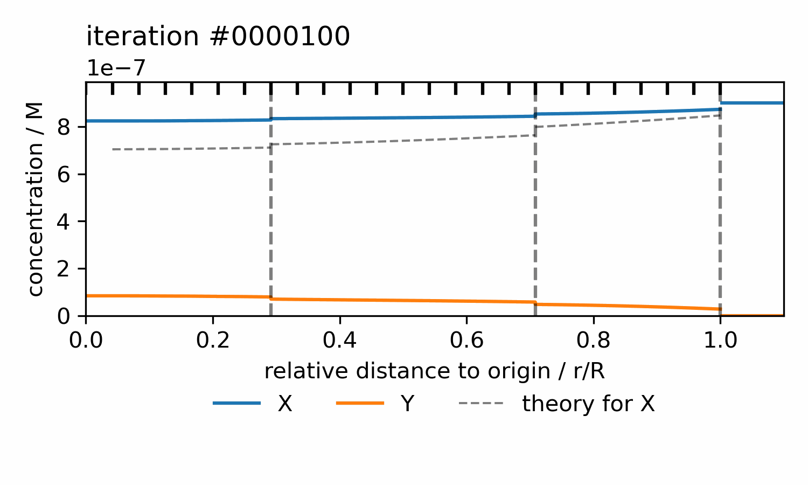

# Numerical solver of chemical reactions within concentric spherical semi-permeable membranes

This code is for calculating the steady state concentrations of substances placed in a spherically symmetrical system of semi-permeable membranes, where the concentration of  each of substances outside the exterior membrane is kept constant. Spontaneous and enzymatic reactions can be defined (enzymes can be placed in the regions between semi-permeable membranes) and an arbitrary number of semi-permeable membranes can be used. The boundary problem is solved numerically through the Newton method. The solver comes to an end once it is not possible to further reduce the norm of the residual with the given mesh or once the net flux (reaction flux + boundary flux) of each species is "close enough" to 0 (see below for more details).



## Summary

The governing equations for each species $q$ are reaction-diffusion equations of the form
```math
\frac{\partial q}{\partial t} = D_q \nabla^2 q + R_q
```
with $D_q$ the diffusion constant and $R_q$ the reaction term resulting from chemical reactions between the different species and/or enzymes,
and with the flux at the boundaries given by
```math
J = p \cdot (q(r^-) - q(r^+))
```
where $q(r^-)$ and $q(r^+)$ are the concentrations of $q$ at either side of the boundary. For each species, $q(R^+)$ is constant.

The steady state distribution of $q$ is computed numerically.

The interval $[0, R]$ is discretized by setting equally spaced mesh points. The position of each inner membrane is set to the closest mesh point position. For $N$ inner membranes defined, there are $N+1$ regions. Each region is defined by the mesh points within its bounds, including those at the bounding membranes. (Therefore, at the mesh positions where a inner boundary is at, there are in actuality 2 mesh points.)

The solution is assumed to have converged well enough if the net flux computed (the reaction flux minus the flux through the boundary) is close to zero for each species (i.e. mass conservation for each species, see theory part).

This work continues previous work by Hinzpeter et al: Optimal Compartmentalization Strategies for Metabolic Microcompartments, by Hinzpeter et al. (Biophysical Journal, 2017)

**IMPORTANT**: ratios different to 1:1 between reactants and products is not yet implemented!

## How to use the code
The code uses `snakemake` for system management in order to be able to run reproducible and scalable data analyses. 
It is easy to use in combination with Anaconda/Miniconda. For usage with Miniconda:

1. make a new environment (e.g. named `snakemake_env`) and install snakemake
    ```bash
    conda create -n snakemake_env -c conda-forge -c bioconda snakemake
    ```
2. activate the new environment
    ```bash
    conda activate snakemake_env
    ```
3. follow the instructions in the Snakefile to run the scripts

**Running on a SLURM cluster** (not tested yet):
1. make an environment
    ```bash
    mamba install -c conda-forge -c bioconda snakemake snakemake-executor-plugin-slurm
    ```
2. Run Snakemake from a SLURM login/head node (or any node that has access to sbatch). The plugin submits jobs via SLURM.
3. Run once from the command line:
    ```bash
    snakemake \
    --executor slurm \
    --jobs 100 \
    --use-conda \
    --default-resources \
    --rerun-incomplete
    ```
    or using profile data, run using `snakemake --profile profiles/slurm`


## Parameters in the model
The parameters in the model are those defined in the following files (with example values introduced):

```yaml
# species.csv
```
| name    | diffusion_constant | external_concentration | permeability_constant |
| -------- | ----------------- | ---------------------- | --------------------- | 
| X  |  6.6e-10   | 90e-8 | 25e-6|
| Y  |  8.2e-10   | 0 | 15e-6|
| Z  |  4.2e-10   | 0 | 5e-6| 


```yaml
# spontaneous_reactions.csv
```
| start_species    | end_species | ratio_endtostart_species | k |
| -------- | ----------------- | ---------------------- | --------------------- | 
|  X |  Y   | 1:1| 1e-3| 


```yaml
# enzymes.csv
```
| name    | quantity | regions |
| -------- | ------- | -------- |
|  A  | 25e-2| [0,1] |

(A given quantity of) enzymes are placed within the regions specified. The concentration (in volume) is uniform.
```yaml
# enzymatic_reactions.csv
```
| start_species    | end_species | ratio_endtostart_species | enzyme | k_cat | k_M | hill |
| -------- | ------- | -------- | -------- | ------- | -------- | -------- |
| X |  Z   | 1:1| A  |  0.75   | 1.25e-4 | 1 |

Enzymatic reaction are defined given Michaelis-Menten kinetics. Hill exponents are added for cooperativity.

Automatic checks are included such that it is ensured that all species and enzymes that take place in reactions have their properties defined.

```yaml
# parameters_geometry.yaml
geometry_config:
    internal_membrane_relative_radii: [ 0.3, 0.7 ] # the positions of inner membranes in terms of the outer-most radius. list
    outer_membrane_radius: 1.0e-5 # given in meters
```

```yaml
# parameters_solver_input.yaml

geometry_parameters: 
    num_mesh_points: 25 # number of different mesh positions
                        # (the total number of mesh points is larger due to
                        # duplicate mesh points at inner boundaries)

newton_parameters:
    override_adaptive_method: false # an adaptive method for the step in concentrations
                                    # is used as the default

adaptive_step_parameters: 
    initial_alpha: 1.0 # alpha is the scaling factor for the computed step 
                        # in concentrations via the Newton method
    alpha_min: 1.0e-3
    alpha_max: 10
    gamma_inc: 1.15
    gamma_dec: 0.5 # factor by which alpha is multiplied when the residual norm does not decrease
    max_num_accepted_successive_unsuccessful_steps: 10 # used to stop iterations of Newton once the
        # most accurate solution with the given number of mesh points is found

output_options:
    log_convergence_progress: true # if true, logs relative net flux for each species
    save_data_every: 100 # save quantities specified by variables_to_save given 
                            # this number of iterations; if nothing should be saved, set to 0
    create_gif_with_saved_data: true # to create a gif with the saved concentrations
                                     # at the end of the simulation
    log_iteration_info_every: 100 # log inforation about (adaptive) step size and 
                                    # number of successive unsuccessful steps
    delete_data_at_the_end: true # if true, deletes files specified by variables_to_save at the end
    plot_iteration_data_during_simulation: false # if true, plots the .png file for the latest
                                                # saved iteration with the latest calculated concentration

variables_to_save:
    save_F_vector: false # save residual vector as a .txt
    save_F_vector_norm: false # save norm of residual vector as a .txt
    save_J_matrix: false # save the (sparse) jacobian matrix as a .txt
                            # (saves only the non-zero elements with their value and position)
    save_du_vector: false # save the vector that encodes the change in the concentrations
    save_concentrations: true # save the concentrations (needed for creating the gif)
    save_du_vector_max: false # save the maximum step change in the concentrations 
```

```yaml
# parameters_solver_params.yaml 

convergence_parameters:
    tol_relative_value: 1 # factor by which the initial norm of the residual must be reduced 
    tol_absolute_factor: 1 # obsolete, similar to above; read code
    tol_residual_factor: 1 # obsolete, similar to above; read code
    tol_relative_flux_deviation: 0.01 # upper threshold for the relative net flux
                                        # with which the balance condition is accepted

newton_parameters:
    check_convergence_every: 100 # every how many iterations to check the convergence coditions
```

The source code defined in the snakemake rules runs on files with this format.

**Defining the phase space spanned by combinations of parameter values:**

In order to efficiently run simulations testing out different regions in phase space, it is possible to provide a set of values for each of the parameters in the model. Individual simulations can then be run with each combination from the cartesian product of all these sets. 

To do so:
1. Create copies of the template files in the `/src` folder by running `python src/_create_parameters_template.py path_to_new_folder`.
2. Modify the entries in the `.yaml` and `.csv` files such that each entry contains a list of all the values that entry must take. (If all simulations share one same value for a given parameter, the list has length 1).
3. Create the files with the same format as above by running `python src/_create_templates_expanded.py path_to_new_folder` and `python src/_create_phase_space.py path_to_new_folder`. The different combinations are in folders that start with `combination*`.

IMPORTANT: it is very important that the ratios between end and start species are written in `" " ` in order that it is read as a string and not a sexagesimal number.

## Theory
In spherical symmetry (assuming no angular dependence), the steady-state reaction-diffusion equation for one species becomes

```math
\frac{1}{r^2} \frac{d}{dr} \left( r^2 \frac{du}{dr} \right) + \frac{1}{D_u} R_u(u,v...) = 0 \ ,
```
which simplifies to
```math
\frac{d^2u}{dr^2} + \frac{2}{r} \frac{du}{dr} + \frac{1}{D_u} R_u(u,v...) = 0 \ .
```

(Note the singularity at $r=0$).

Using
```math
\begin{cases}
y_0 = u \\
y_1 = \frac{du}{dr} \\\end{cases}
```
we define each of the $2^\mathrm{nd}$ order differential equations (one for each species) as 2 $1^\mathrm{st}$ order differential equations of the form
```math
\begin{cases}
\frac{dy_0}{dr} = y_1 \\
\frac{dy_1}{dr} = -\frac{2}{r} y_1 - \frac{1}{D} R_y(y_0, z_0...)
\end{cases}
```

As for the boundary conditions:

At $r=0$ we use reflection
```math
\frac{du}{dr}(0) = 0
```
such that
```math
\left(\frac{dy_0}{dr}(0) = \right)\ \  y_1(0) = 0
```
and at $r=R$ we have
```math
\frac{du}{dr}(R) = [u_\mathrm{ext} − u(R)] \cdot \frac{p_u}{D_u}
```
such that
```math
y_1(R) = \left(u_{ext} - y_0(R)\right) \cdot \frac{p_u}{D_u}
```
with $p_u$ and $D_u$ the permeability to each membrane and diffusion constant for substance $u$, respectively.

**Matrix formulation**:

Given $m$ species and $n$ compartments (i.e. $n-1$ inner membranes at $r_i$ with $i \in \{1,2,...,n-1\} $) we have $m \cdot [2 + (n-1)\cdot 2] = 2mn$ boundary conditions (since for each species we have one BC at $r=0$, one BC at $r=R$, one BC at each side of each inner membrane).

In order to use the Newton method to solve the whole system, we define $2\cdot m\cdot n$ variables, with $k\in \{0, 1, ..., n-1\}$

```math
v_k^{(m)} \coloneqq u_k^{(m)}
```
```math
w_k^{(m)} \coloneqq \frac{\mathrm{d}u_k^{(m)}}{\mathrm{d}r}
```
with their derivatives given by
```math
\frac{\mathrm{d}v_k^{(m)}}{\mathrm{d}r} = w_k^{(m)}
```
```math
\frac{\mathrm{d}w_k^{(m)}}{\mathrm{d}r} = -\frac{2}{r} w_k^{(m)}-\frac{1}{D}R(\vec{v}_k)
```

The boundary conditions are then given by
```math
w^{(m)}(0) = 0
```
for the interior boundary condition, (Neumann, no-flux BC),
```math
w^{(m)}(R) = \left(u_\mathrm{ext} - v^{(m)}(R)\right) \cdot \frac{p^{(m)}}{D^{(m)}}
```
for the condition at the outer-most membrane, and
```math
w_i^{(m)}(r_i^+) =  \frac{p^{(m)}}{D} \cdot \left( v_{i}^{(m)}(r_i^+) - v_{i-1}^{(m)}(r_i^-)\right)
```
```math
w_{i-1}^{(m)}(r_i^-) =  \frac{p^{(m)}}{D} \cdot \left( v_{i}^{(m)}(r_i^+) - v_{i-1}^{(m)}(r_i^-)\right)
```
for the inner membranes (i.e. Robin BC).

There is a concentration jump at the membranes, but the flux is continuous.

For the discretization, we used

```math
f'(x_i) = \frac{1}{2h}(f_{i+1}-f_{i-1}) + O(h^2)
```

**Calculating the net flux**

As a convergence condition, we establish that the (total) net flux should be close to 0.

We define the flux coming through the exterior membrane to be
```math
\Phi_\mathrm{ext}^{(m)} = 4 \cdot \pi \cdot p_u\cdot (v_\mathrm{ext}^{(m)} - v^{(m)}(R))
```
such that it is positive if there is a flux into the sphere and negative if there is a flux towards the outside of the sphere.

We estimate the reaction flux for each region by calculating the reaction fluxes caused by the local concentrations at each mesh point (including the mesh points at either end of the interval), interpolating the reaction fluxes at the positions between each of these mesh points and adding these reaction fluxes, weighted by the volume of the hollow sphere spanned by the two elements from which the interpolation was calculated.
```math
\Phi_\mathrm{react}^{(m)} = \sum_{i=0}^{N-1} \frac{R^{(m)}_i + R^{(m)}_{i+1}} {2}\cdot \frac{4}{3} \cdot \pi \cdot \left(r_{i+1}^3 - r_i^3\right)
```
with the index $i$ traversing through the mesh points within a region with increasing $r$ and $R_i^{(m)}$ the computed reaction term from the local concentrations of all species and enzymes.
The total reaction flux is the sum from the reaction fluxes within each region.

We define a relative net flux $\Phi^{(m)}$ for each species $m$ through
```math
\Phi^{(m)} = \frac{|\Phi_\mathrm{ext}^{(m)} + \Phi_\mathrm{react}^{(m)}|}{\mathrm{max}(|\Phi_\mathrm{ext}^{(m)}|, |\Phi_\mathrm{react}^{(m)}|)}
```
Balance between the flux created through interaction with the outside and the flux created through reactions within the sphere must be ensured for the steady state. We consider that the steady state has been found numerically once this balance is smaller than some small $\epsilon > 0$.

It is important to note that the net flux may not cross the threshold given by $\epsilon$ if the step size between neighboring mesh points is too large.


## Typical values

Diffusion coefficient of l-Trp taken as $6.6\cdot 10^{-6} cm^{2} s^{-1} = 6.6\cdot 10^{-10} m^{2} s^{-1}$ (estimated from https://pmc.ncbi.nlm.nih.gov/articles/PMC16526/).
Assuming same diffusion coefficient for the other values.

Following https://pubs.acs.org/doi/pdf/10.1021/acsomega.3c08233?ref=article_openPDF (quantification of kinetics of VioA) we assume $k_\mathrm{M} = 125 \mu M = 1.25\cdot 10^{-4}M$ and $k_\mathrm{cat} = 0.75 s^{-1}$ for all enzymes.

For the external concentration of l-Trp we're assuming $s_0 = 25 \mu M = 25\cdot 10^{-6}M$ and the permeability $p = 90 \mu M s^{-1} = 90\cdot 10^{-6}M s^{-1}$.
(as in https://www.cell.com/biophysj/fulltext/S0006-3495(16)34263-1?_returnURL=https%3A%2F%2Flinkinghub.elsevier.com%2Fretrieve%2Fpii%2FS0006349516342631%3Fshowall%3Dtrue)

We use a radius of $1\mu m$.

The concentration of enzymes is chosen as $25 mM = 25 \cdot 10^{-3}M$

The specified values are to be given in SI units.


## Cases for which we know the analytical solution

**No reaction**: concentration equal to external concentration (trivial; convergence condition based on comparing reaction flux vs boundary flux not viable)

**Simple case of decay of compound X into compound Y, with no inner boundaries**: 

The reaction-diffusion equation in spherical coordinates is given by
```math
D \nabla^2 c - kc = D \frac{1}{r^2} \frac{\partial}{\partial r} \left( r^2 \frac{\partial c}{\partial r}\right) - kc = 0
```

It is solved by
```math
c(r) = \frac{A\mathrm{exp}(-\lambda r) + B\mathrm{exp}(\lambda r)}{r}
```
with $\lambda = \sqrt{k/D}$.

The condition for internal reflexion $c^\prime(0) = 0$ leads to $A = -B$.

The condition at the outer membrane $c^\prime(R) = p/D \cdot (c_\mathrm{ext} - c(R))$ means 
```math
A = -\frac{\dfrac{p}{D}\,c_{\mathrm{ext}}\,R^2}
{e^{\lambda R}\left(\lambda R - 1 + \dfrac{pR}{D}\right)
+ e^{-\lambda R}\left(\lambda R + 1 - \dfrac{pR}{D}\right)}
```

**Simple case of decay of compound X into compound Y, with one inner boundary at $R^*$**:
Both individual segments (aka $[0, R^*)$ and $(R^*, R]$) follow
```math
c(r) = \frac{A\mathrm{exp}(-\lambda r) + B\mathrm{exp}(\lambda r)}{r}
```
with $\lambda = \sqrt{k/D}$.

We know
```math
c^\prime(0) = 0
```
```math
c^\prime(R^*_-) = c^\prime(R^*_+) = p / D \cdot (c(R^*_+)- c(R^*_-))
```
```math
c^\prime(R) = p/D \cdot (c_\mathrm{ext} - c(R))
```

We define 
```math
c(r)=
\begin{cases}
c_1(r), & 0\le r<R^*\\[6pt]
c_2(r), & R^*<r\le R
\end{cases}
```


Similarly to above, reflexion at $r=0$ leads to
```math
c_1(r)=\frac{S\,\sinh(\lambda r)}{r}
```
```math
c_2(r)=\frac{A e^{-\lambda r}+B e^{\lambda r}}{r}
```

We define
```math
s=\sinh(\lambda R^*), 
\qquad
c=\cosh(\lambda R^*), 
\qquad
\beta=\frac{p}{D},
\qquad
\alpha=\frac{pR}{D}.
```
The final expression is given by
```math
B=\rho A 
```

```math
\rho
=
e^{-2\lambda R^*}
\frac{
D\left(R^{*2}\lambda^2 c+R^*\lambda(c-s)-s\right)
+pR^{*2}\lambda(s+c)
}{
D\left(R^{*2}\lambda^2 c-R^*\lambda(s+c)+s\right)
+pR^{*2}\lambda(s-c)
}.
```


```math
A
=
\frac{\beta c_{\mathrm{ext}} R^2}{
e^{-\lambda R}(\alpha-\lambda R-1)
+
\rho e^{\lambda R}(\alpha+\lambda R-1)
},
```


